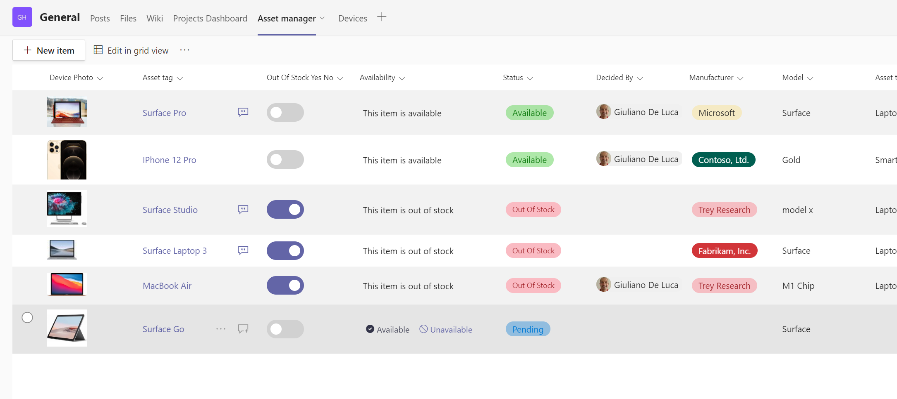

# 🔲How to add buttons in a Microsoft or SharePoint List with list formatting [NO CODE SOLUTION]

This is an example of how to use list formatting and the property setValue which allows you to enhance other columns:

## Requirements
The following column have to be created in the Microsoft or SharePoint list:
**Status**: choice field with some value (Pending, Available, Unavailable, Out of Stock)
**OutOfStockYesNo**: Yes/No column
**DecidedBy**: Person column
**Availability**: Calculated column that displays the buttons

📺check my YouTube Video tutorial to follow a step-by-step guide:
https://youtu.be/JmZKkfy3Tx8

🔗Microsoft article about List Formatting:
https://docs.microsoft.com/en-us/sharepoint/dev/declarative-customization/column-formatting